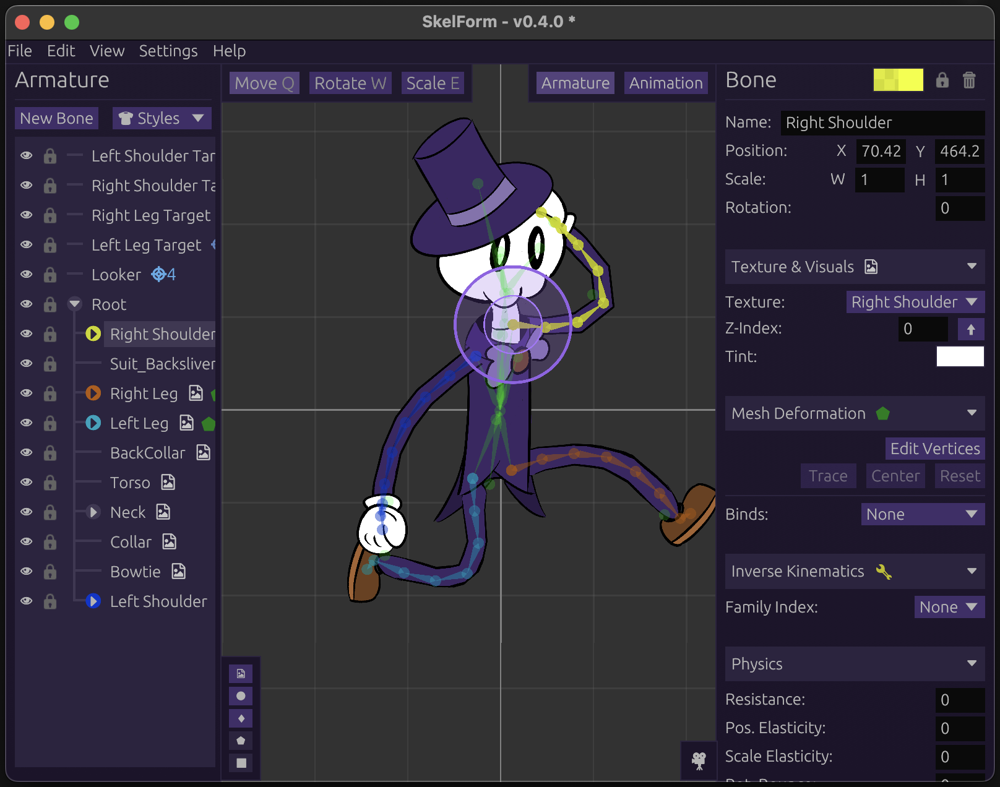

	<h1>Keyternity</h1>
	<h3>A 2D skeletal animator built for artists</h3>
	

		<a href="docs/BIND_POSE.md">🦴 Bind Pose Skinning</a> -
		<a href="docs/DRAGONBONES_IMPORT.md">📥 DragonBones Import</a> -
		<a href="docs/DRAGONBONES_EXPORT.md">📤 DragonBones Export</a> -
		<a href="docs/FFMPEG.md">🎞️ FFmpeg</a>
	

	

		
	

## Keyternity

Keyternity is a 2D skeletal animation editor: rig a character from layered art,
animate it with keyframes, inverse kinematics and mesh deformation, and export it
for games, apps and other runtimes.

It's the animation tool for [Inkternity](https://github.com/inviti8/inkternity),
an infinite-canvas comic app that plays 2D skeletal rigs. Keyternity speaks
**DragonBones**, the format Inkternity embeds, in both directions, and it focuses
on artist-facing workflow: standard bind-pose skinning, a Pose mode for testing
rigs, and a display that keeps art and rig visually apart.

### A fork of SkelForm

Keyternity is a fork of [Retropaint/SkelForm](https://github.com/Retropaint/SkelForm).
Everything not listed below comes from SkelForm: the editor, the renderer,
bones, IK, meshes, styles, animation, export, the `.skf` format and its runtimes.

Keyternity and SkelForm **diverged on 2026-09-30**, from upstream commit
`68b66d21` (2026-09-11). Keyternity's additions were offered upstream first
([#12](https://github.com/Retropaint/SkelForm/pull/12),
[#13](https://github.com/Retropaint/SkelForm/pull/13)), but they're outside the
scope SkelForm wants to maintain. So Keyternity is developed independently and
doesn't track upstream; useful upstream fixes may be picked over case by case.

Rigs stay SkelForm `.skf` files. The format and the runtimes are unchanged:
Bind Pose works through ordinary helper bones, so a Keyternity rig plays on
SkelForm's runtimes as is.

## What Keyternity adds on top of SkelForm

- **DragonBones import** — File › Open a `<name>_ske.json`, with its
  `_tex.json`/`_tex.png` atlas pages. You get bones, slots and display swaps,
  draw order, color, eased and curved keyframes, IK, and weighted meshes; trimmed
  and rotated atlas regions are handled. IK chains, and bones that don't inherit
  their parent's transform, are baked from a port of the DragonBones runtime's
  own bone update and IK solver. Anything that can't be carried over exactly (FFD
  mesh deform, nested armatures, skew, color offsets, events) is listed after
  import. Checked frame by frame against the reference DragonBonesCPP runtime: 40
  of its 43 sample rigs match within ~1 px
  ([verification](docs/DRAGONBONES_VERIFY.md))
- **DragonBones export** — Export › DragonBones writes DragonBones 5.5 JSON
  (`_ske.json` + `_tex.json` + `_tex.png`) for DragonBones runtimes. It covers
  bones, textures, meshes and weights, animations with easing, draw order, and
  visibility; IK is baked into rotations. Bind-posed meshes export as native
  DragonBones skinning. Round trips (Keyternity → DragonBones → Keyternity) match
  within 0.013 px
- **Bind Pose skinning** — standard, 3D-style skinning for meshes blended across
  several bones. Vertices follow each bone relative to where it was when bound,
  so weights can be edited freely without vertices jumping, and the bind pose
  tracks the setup pose (Blender-style). This works through greyed-out,
  read-only helper bones, with no file-format or runtime changes. Set it per mesh
  or for the whole rig. A warning flags classic multi-bind vertices that would
  sit out of position ([design](docs/BIND_POSE.md))
- **Pose mode** — an Armature | Pose | Animation mode tab. Move bones freely to
  test how meshes deform, without an animation and without touching the rest
  pose. Leaving the tab restores every bone; pose edits stay out of undo history,
  and saves and exports always use the rest pose
- **Attachment display** — Settings › Rendering › *Show textured bones as
  attachments*: bones that show a texture draw as a small dot with a thin line to
  their parent instead of a full bone, keeping the rig visually separate from the
  art. The attachment color is configurable
- **Verified FFmpeg** — video export uses FFmpeg from its official publishers
  only, pinned and checked by SHA-256. The Windows installer downloads the
  official gyan.dev build; Linux and macOS use the system's ffmpeg. The repo
  carries no third-party binaries ([details](docs/FFMPEG.md))
- **Fixes**
  - Unused Textures no longer lists textures that animations swap in
  - "Download ffmpeg" no longer crashes when the app folder isn't writable

## Inherited from SkelForm

- Bone hierarchies with per-component inheritance, pivots and textures
- Keyframe animation with easing curves and onion skinning
- Inverse kinematics families (FABRIK and Arc), with constraints
- Meshes with vertex binds, weights and path binds
- Styles: hot-swappable texture sets for outfits and skins
- Physics on bones
- Photoshop (`.psd`) import of layered art
- Export of armatures (`.skf`/`.skfe` with texture atlases), images,
  spritesheets and video
- Runtimes and runtime documentation for integrating rigs in games and apps
  ([skelform.org](https://skelform.org))
- Native desktop builds (Windows, macOS, Linux) and a web build

## Status

Keyternity is under active development, and there's no release yet. The first
release is planned as `v0.1.0`; Keyternity versions start fresh rather than
continuing SkelForm's. Until the rename pass lands, the app still calls itself
SkelForm in places (window title, installer, config folder).

Build from source as described below.

## Building

Install Rust v1.85.0 or above, then run `cargo run`.

### Linux

Dependencies:

- glib2-dev - required for the `rfd` crate (file dialogs)
- gtk3-dev - ditto above

Library names may differ across distributions. Video export uses the system's
`ffmpeg`.

### Web

Install [Trunk](https://trunkrs.dev) v0.21.7 or above, and Python 3.13.6 or
above. Then run `web_build.py` to build the `dist` folder. It also fetches the
pinned, checksum-verified ffmpeg.wasm files.

Notable arguments:

- `--serve` - run `localhost:8000` after the build
- `--release` - build for release (requires changing the base url to test locally)

### Native desktop release

See the `release` folder.

### Tests

- `cargo test --test bind_pose`
- `cargo test --test dragonbones_export`
- `cargo test --test dragonbones_import -- --ignored` (opt-in; needs MSVC and a
  DragonBonesCPP checkout, see [DRAGONBONES_VERIFY.md](docs/DRAGONBONES_VERIFY.md))
- `cargo test --test ffmpeg_download -- --ignored` (opt-in, Windows; downloads
  the pinned FFmpeg build)

## Documentation

- Keyternity's additions: the `docs` folder
- Code: `cargo doc --no-deps --open`
- Editor and runtime usage: SkelForm's
  [user documentation](https://skelform.org/user-docs) and
  [dev documentation](https://skelform.org/dev-docs) still apply to everything
  inherited

## Contribution

Issue reports (bugs and feature requests) are welcome. For pull requests of any
meaningful size, please open an issue first.

## License

Keyternity is distributed under the [GNU General Public License v3.0](LICENSE.md),
the license it inherits from SkelForm. SkelForm is © Retropaint and contributors;
Keyternity's changes are © their authors and released under the same license.
As GPLv3 requires, [`NOTICE`](NOTICE) records the lineage and the modifications.

FFmpeg is not included; it's downloaded from its publishers under its own license
(see [docs/FFMPEG.md](docs/FFMPEG.md)).

## Acknowledgements & Attributions

Keyternity is built on [SkelForm](https://github.com/Retropaint/SkelForm) by
Retropaint.

From SkelForm:

- Built on top of
  [matthewjberger/wgpu-example](https://github.com/matthewjberger/wgpu-example)
- FABRIK technique by
  [Programming Chaos](https://www.youtube.com/watch?v=NfuO66wsuRg)
- Inverse Kinematics icon by lucysir
- Lock icon provided by
  [boxicons](https://boxicons.com/icons/lock-keyhole?free=true&q=lock-keyhole&p=filled)

DragonBones verification uses the
[DragonBonesCPP](https://github.com/DragonBones/DragonBonesCPP) runtime.
